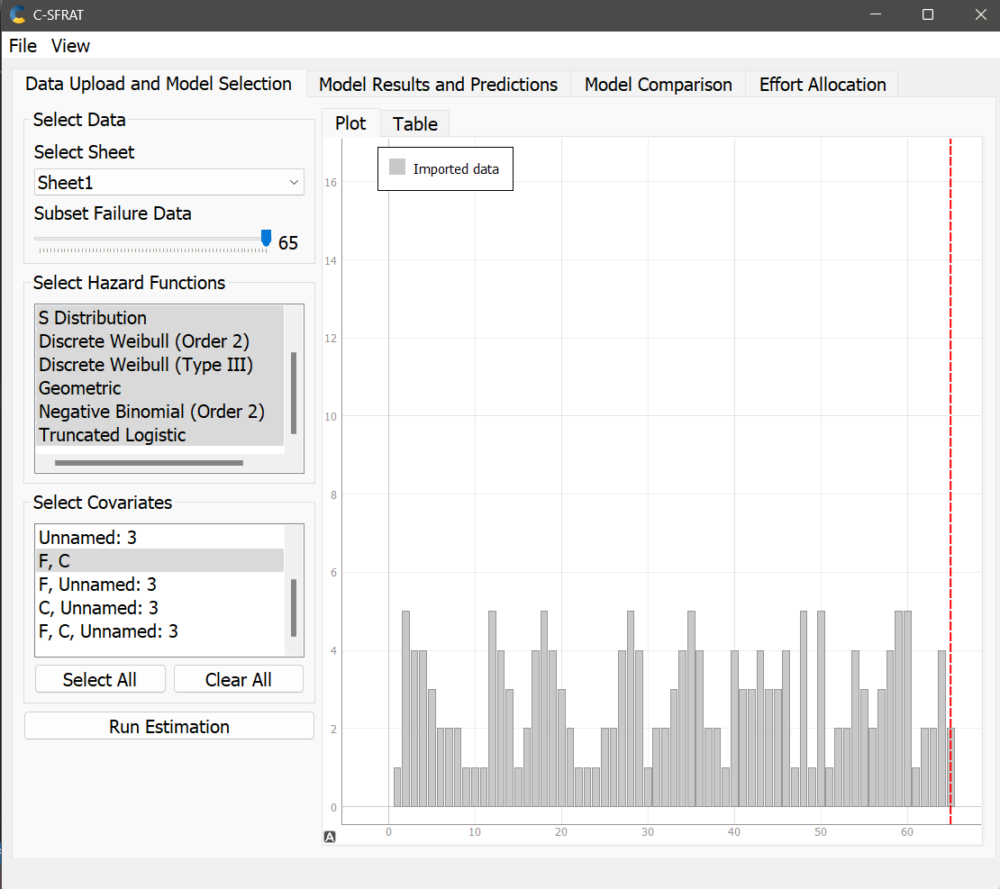
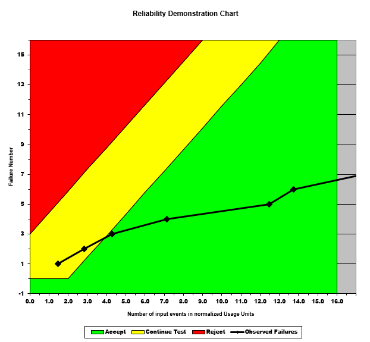

**SENG 438- Software Testing, Reliability, and Quality**

**Lab. Report \#5 – Software Reliability Assessment**

| Group \#:       | 9  |
|-----------------|---|
| Student Names:  | Christina Wyllie  |
|                 | Maitry Rohit  |
|                 | Sobia Khan |
|                 | Jamie Stade |

# Introduction
The purpose of this lab is to learn about software reliability and the tools available to measure the reliabilty of a system. The team will be comparing reliability growth testing to reliabilty demonstration chart testing, explaining how each system works and how they are similar to different to each other. 

# Assessment Using Reliability Growth Testing 
The team decided to use the C-SFRAT program and convert the Failure Report 2 to an xls file to be able to analyze it. 

The original data imported can be seen here:

The failure rate does not decrease as time goes on. The patterns remain consistent. 

The graph generated data with the C and F covariate.

As a group we then analyzed the best fit for the graph by examining log-likelihood. The higher that value is the more accurate the model. The two models chosen were the geometric and the discrete weibull type. Both of these has a log likihood around -113. 

Analyzing the failure intesity graph we can observe that the failure rate remains consistent. This demonstrates that the data set does not have strong reliability growth. 

Additionally, after reviewing the MVF graph. We used the prediction tool to predict to 99 intervals. 

This shows that the amount of new failures has decreased since the original data. This represents an increase in reliability because the system is slowly approaching a plateau. 

## Laplace Graph and Finding the Ideal Range

We used the above equation to calculate the laplace of each data point we had from report 2.

We calculated the values in excel and plotted it in excel. Given these laplace values it was determined that the the best range would be the one with the most decline because that is where there is the most reliability growth. Ideally, this range would be 1-11 however given that there are very few data points the team then decided on using 1-24 as an acceptable range. 

## A Discussion on Decision Making Given a Target Failure Rate

The target failure rate the group has chosen is .3. We came to this conclusion by testing other target failure rates and seeing how the decline changes. Though this means that far more testing needs to occur, with the data given it is impossible to have a greater target. Additionally, when calculating the MTTF on the laplace graph the value given was .35. This is consistent to the failure intensity target.  

## Advantages and Disadvantages of Reliability Growth Analysis
Reliability Growth Analysis (RGA) allows us to assess the data from our RGT in terms of time. Since it uses time to analyze the data, an advantage of this is that we can see the reliability growth over time and how much improvement is needed to the system. We were able to use several different models in order to find the one that best suited our data and what we wanted the model to depict, thus allowing for a lot of flexibility in the analysis. However, RGA does have its disadvantages. When we were initially figuring out an acceptable range for our data using laplace, we found that if we did not use enough data points, the models would not work. A lot of data is needed in order to make this type of analysis work as intended, which can be hard when you don't have the time or money to collect this data. 

# Assessment Using Reliability Demonstration Chart 

## Reliability Demonstration Chart

We found an min MTTF of 424 by checking when our observed number of failures graph began to enter the acceptable region. We first generated a graph with the majority of the observed failures in the acceptable region and from there we increased our MTTF until our observed number of failures began to enter the the accepatble region. 

## Twice MTTF

To generate the twice MTTF graph we mutiplied our number of input events by 2 to get a maximum number of acceptable failures per number of input events of $\frac{3}{2544}$ giving us an MTTF of 848. 

## Half MTTF

To generate the half MTTF Graph we multiplied our original number of input events by 0.5 to get a maximum number of input events of $\frac{3}{636}$ giving us an MTTF of 212.

## Advantages and Disadvantages of RDC
The advantages of RDC was that it was much more intuitive to use as compared to C-SFRAT. It gives clear graphs of which regions the observed failure rate is in and where it needs to reach to become acceptable for the desired MTTF and changing different reliability factors is very simple and quick.

The disadvantages of using RDC can be deciding where to place the reject, continue and accept regions as well as what MTTF to use. As well other failure data, such as the reliability, cannot be found from this approach.

# Comparison of Results
Reliability Growth Testing (RGT) and Reliability Demonstration Chart (RDC) are both good ways to assess reliability, each having their own way of doing so. RGT used models and a failure intensity target to analyze the graph generated by the data. This graph analyzed the data in a failures versus time way. Using RGT, the group found the target failure rate to be 0.3 and the MTTF to be 0.35, measured in hours. Comparatively, RDC utilized MTTF more to generate data and how the failure number versus number of input events behaves. In this part, we found the MTTF to be 424 seconds, which is about 0.12 in hours. This MTTF is 0.23 smaller than that obeserved in part 1, using RGT. The failure rate for part 2 is found by taking the failure number whihch the system enters the green zone, number 5, and the number of input eventsfor this failure number, 6. Given these values, we can calculate the failure rate to be 0.83. Comparing this to the value of 0.3 received in part 1, we can see that the two methods do produce different results, however, they only assess a small part of the data, so if we were to analyze a lager portion of the data, these values would most liekly be closer. While both methods produce different results, and have their own way of getting to these results, they both prove to be a good way to test the reliability of the system. 

# Discussion on Similarity and Differences of the Two Techniques
Reliability Growth Testing and Reliability Demo Chart Testing are both methods used to graph, interpret, and analyze failure data of a system. The RGT method involves calculating reliability trends to determine failure intensity of the system under test, whereas the RDC method uses risk factors to inform whether a system should be rejected or accepted. With the RGT method, we can calculate a quantitative value for the reliability of a system, but the RDC method only indicates whether a system is acceptable or not under the given parameters. However RDC is more useful when failure data is limited because the accuracy of the RGT method depends on the sample size. 

# How the team work/effort was divided and managed
In this lab, Christina worked with the instructors to figure out how the run the reliability software and format the datasets. Sobia and Maitry used the given data to create the reliability growth testing graphs, and calculate the Laplace factor using this data. Sobia also used the test data to create the RDC graphs. Every member contributed to the report and we split the sections up equally.  

# Difficulties encountered, challenges overcome, and lessons learned
This lab was incredibly challenging. Both the understanding the content and excuting the lab was a frustrating experience. It took a long time for the entire group to understand what the datasets actually mean and how they can be displayed in the program. It was hard to figure out what an RDC is and how to use it in additon to understanding what reliability growth testing actually means. After figuring out what to do, the team did learn a lot about C-SFRAT and RDC as well as how to use the laplace equation.

# Comments/feedback on the lab itself
Please confirm that the datasets can work with the given program. More time was spent figuring out the formatting of the dataset to work with the program rather than actually learning and understanding the content of the lab. TA's should run datasets on their laptops and confirm which files work and how they work with the program so that they are better prepared to deal with the students problems during the lab period. 
