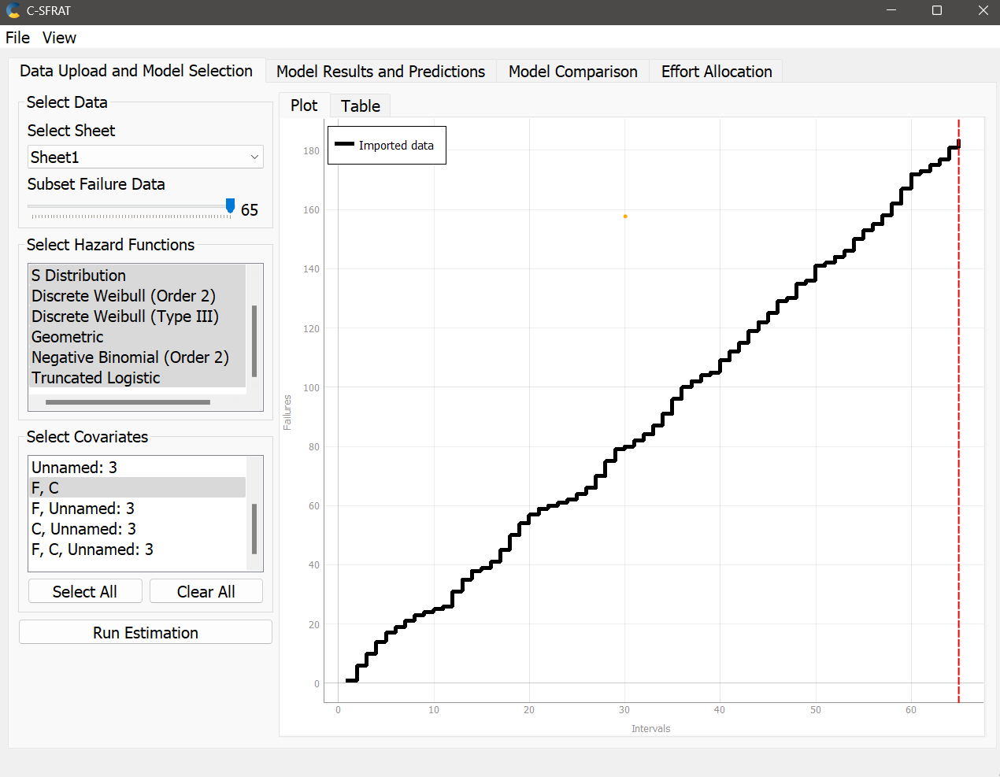
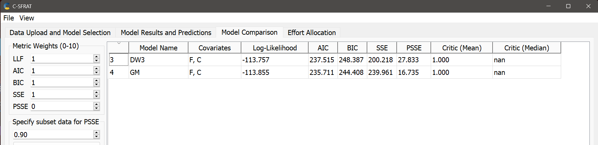

**SENG 438- Software Testing, Reliability, and Quality**

**Lab. Report \#5 – Software Reliability Assessment**

| Group \#:       |   |
|-----------------|---|
| Student Names:  | Christina Wyllie  |
|                 | Maitry Rohit  |
|                 | Sobia Khan |
|                 | Jamie Stade |

# Introduction
The purpose of this lab is to learn about software reliability and the tool available to measure the reliabilty of a system. The team will be comparing reliability growth to reliabilty demonstration and explaining the how each system works and are similar to different to each other. 

# Assessment Using Reliability Growth Testing 
The team decided to use the C-SFRAT program and convert the data2 to an xls file to be able to analyze it. 

The original data imported can be seen here:

The failure rate does not decrease as time goes on. The patterns remain consistent. 

The graph generated data with the C and F covariate. 

As a group we then analyzed the best fit for the graph by examining the critic mean. The closer the critic mean is to 1.000 the more accurate it is to the imported data. 

Analyzing the failure intesity graph we can observe that the failure rate remains consistent. This demonstrates that the data set does not have strong reliability. growth. 

# Assessment Using Reliability Demonstration Chart 

# 

# Comparison of Results

# Discussion on Similarity and Differences of the Two Techniques

# How the team work/effort was divided and managed

# 

# Difficulties encountered, challenges overcome, and lessons learned
This lab was incredibly challenging. Both the understanding the content and excuting the lab was a frustrating experience. It took a long time for the entire group to understand what the datasets actually mean and how they can be displayed in the program. It was hard to figure out what an RDC is and how to use it in additon to understanding what reliability growth testing actually means. 
# Comments/feedback on the lab itself
Please confirm that the datasets can work with the given program. More time was spent figuring out the formatting of the dataset to work with the program rather than actually learning and understanding the content of the lab. TA's should run datasets on their laptops and confirm which files work and how they work with the program so that they are better prepared to deal with the students problems during the lab period. 
